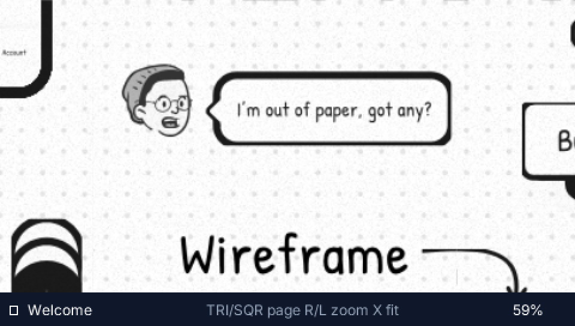
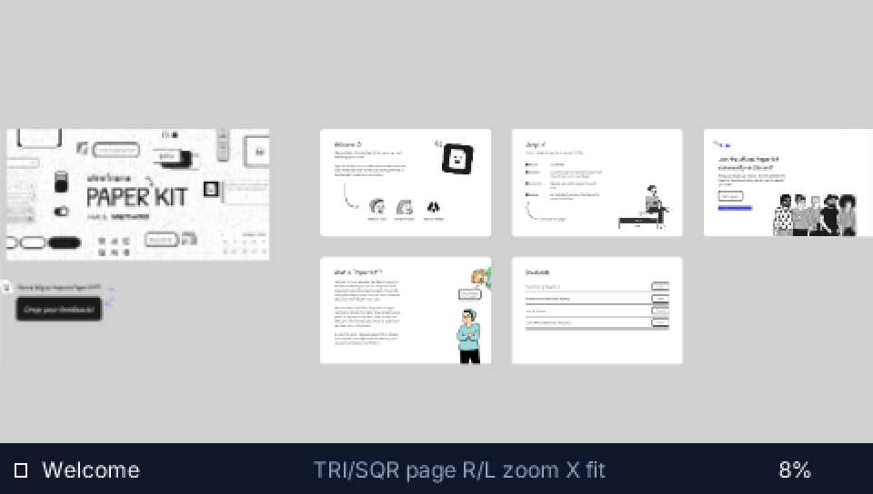
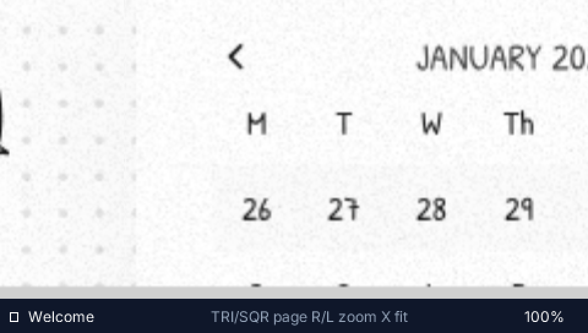
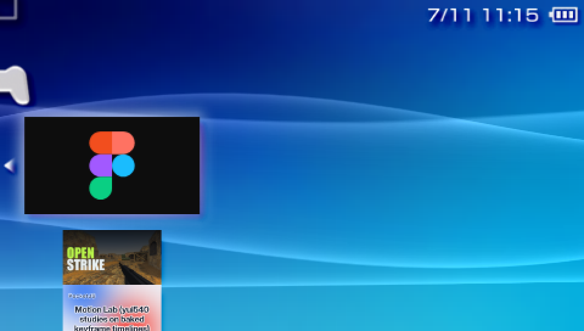

# Pocket Figma

A Figma file viewer for the Sony PSP and PS Vita.



The [Paper Wireframe Kit (Community)](https://www.figma.com/community/file/1075811850250564922)
— 14,430 nodes, 2,293 component instances, hand-drawn Patrick Hand type,
photos, masks — baked at compile time into streamed CLUT8 tile pyramids and
panned with the analog nub at 60 fps on a 2004 handheld. No Figma runtime,
no fonts, no network: the device never parses, it only consumes.

| whole page at 8% | one component at 100% |
|---|---|
|  |  |

Both frames are the executable's own 480×272 framebuffer, captured in the
deterministic emulator the byte-exact tests run on. The full story — what
actually lives inside a `.fig`, the `overrideKey` bug, the tile cooker, the
streaming architecture — is in the blog post:
[Pocket Figma: Figma at 333 MHz](https://pocketjs.dev/blog/pocket-figma/).

Built on [PocketJS](https://github.com/pocket-stack/pocketjs) and its
deep-zoom engine layer (TILESET pak entries, `loadTileTexture`/`freeTexture`
streaming ops, the `<DeepZoom>` component). `pocket-figma` is the first app
in the `pocket-<product>` family; its [`pocket.json`](./pocket.json) is the
reference instance of the [Pocket app manifest](./docs/manifest.md).

## Controls

| input | action |
|---|---|
| Vita front touch: one finger | pan, with inertial release |
| Vita front touch: two fingers | pan and pinch to zoom |
| analog nub / left stick / d-pad | pan |
| R / L trigger | zoom in / out |
| △ / □ | next / previous page |
| ✕ | fit page |

## Build

```sh
bun run setup         # submodules + vendored deps
bun run bootstrap     # install the pinned PSP toolchain into the shared cache
bun run bake          # regenerate committed 1x + 2x tile pyramids from the .fig
bun run check:platforms  # validate the PSP baseline against PSP and Vita
bun run build         # dist/main.js + dist/main.pak (bundle + baked tiles)
bun run psp -- -r     # dist/EBOOT.PBP — copy to ms0:/PSP/GAME/PocketFigma/
bun run vita -- -r    # dist/vita/PocketFigma.vpk — native 960x544 Vita build
bun run desktop       # run windowed via the vendored uihost (wgpu)
bun run golden        # byte-exact 960x544 controller/touch/fullscreen goldens
bun run e2e:vita      # build the VPK and compare native Vita3K captures
```

PSP builds resolve the normalized SDK in a fixed order: `PSP_SDK`, then
`PSPDEV`, then Pocket's versioned shared cache at
`$XDG_CACHE_HOME/pocket-stack/psp/sdk/sdk-noabicalls-normalized-2026-06-19/mipsel-sony-psp`
(or the same path under `~/.cache`). Both SDK environment variables are then
exported to the build, so Rust and QuickJS cannot silently select different
toolchains. The SDK, `rust-psp`, and `quickjs-rs` sources and exact revisions
come from PocketJS's single toolchain manifest and the `pocket-stack`
organization repositories. No DreamCart checkout is required.

The Vita target keeps PocketJS's 480×272 logical canvas while selecting the
512-pixel (`@2x`) version of each 256-logical-pixel tile. Layout, pan and zoom
therefore stay identical to PSP, but Figma vectors, type and photos reach the
native 960×544 display with twice the raster detail. Selection comes from
`platform.pixelRatio`, not a Vita-specific branch. Physical buttons and the
left stick map onto the same deterministic input contract as PSP. On Vita,
front-panel contacts arrive in the same logical coordinate space: one finger
directly pans with inertial release, while two fingers pan and pinch around
their centroid. PSP keeps the complete controller fallback because touch is
declared as an optional `input.touch` enhancement rather than a requirement.
The release VPK has the stable Vita Title ID `PFIG00001`, so it installs as
Pocket Figma alongside PocketJS demos and OpenStrike instead of replacing
them. Its final package goes through PocketJS's shared Vita asset resolver:
Pocket Figma's icon, 840×500 background, 280×158 startup image, and template
overlay the framework defaults as one validated LiveArea contract.

Vita builds expect VitaSDK (via `$VITASDK`, falling back to `~/vitasdk`),
`cargo-vita`, and the pinned Rust nightly in
`crates/pocket-figma-vita/rust-toolchain.toml`. The native E2E command also
expects Vita3K to have been launched once so it can clone a local
`config.yml`; it uses its own VitaFS below `out/` and never rewrites the
emulator's normal configuration.

The baked tiles are committed: 5.9 MB at 1x and 15.7 MB at 2x across four
pages. `bun run bake` regenerates both sets serially from a local copy of the
.fig (`--fig=<path>`, defaults to
`~/Downloads/Paper Wireframe Kit (Community).fig`). The density-2 bake writes
`@2x.bin` siblings and `tiles@2x.ts` without replacing the base `pak.json`.
`bun run cover` regenerates the XMB and LiveArea art (ImageMagick is used for
Vita's palette-PNG format): the icon is the Figma logo mark, drawn by the
script itself; the backdrop is the kit's own cover, rendered from the .fig.



The result on a real PSP's game menu, screenshotted on the hardware itself.
Real hardware needs custom firmware; PPSSPP runs the EBOOT as-is.

## Layout

```
pocket.json          the Pocket app manifest (docs/manifest.md)
app/                 the viewer — main.tsx entry, app.tsx, baked tiles + manifest
tools/               fig.ts (.fig decoder/renderer) + gen-assets.ts (tile baker)
crates/              PSP EBOOT + PS Vita VPK bins (embed the same bundle + pak)
scripts/             psp.ts / vita.ts / desktop.ts build drivers
docs/                manifest spec + the screenshots above
art/                 ICON0 / PIC1 (generated by tools/gen-cover.ts)
vendor/              pocketjs · rust-psp · quickjs-rs submodules
```

## Credits

- Paper Wireframe Kit by **Method** (Tyler Sharpe & Claire Lorman),
  [Figma Community](https://www.figma.com/community/file/1075811850250564922), CC BY 4.0.
  The kit is rendered from its own file's derived geometry; the .fig itself is
  not redistributed here.
- The `.fig` container is decoded with [kiwi](https://github.com/evanw/kiwi),
  Evan Wallace's schema format — reading his file format with his own tools
  felt right.
- Figma and the Figma logo are trademarks of Figma, Inc. Pocket Figma is an
  unofficial community project, not affiliated with or endorsed by Figma.

MIT.
